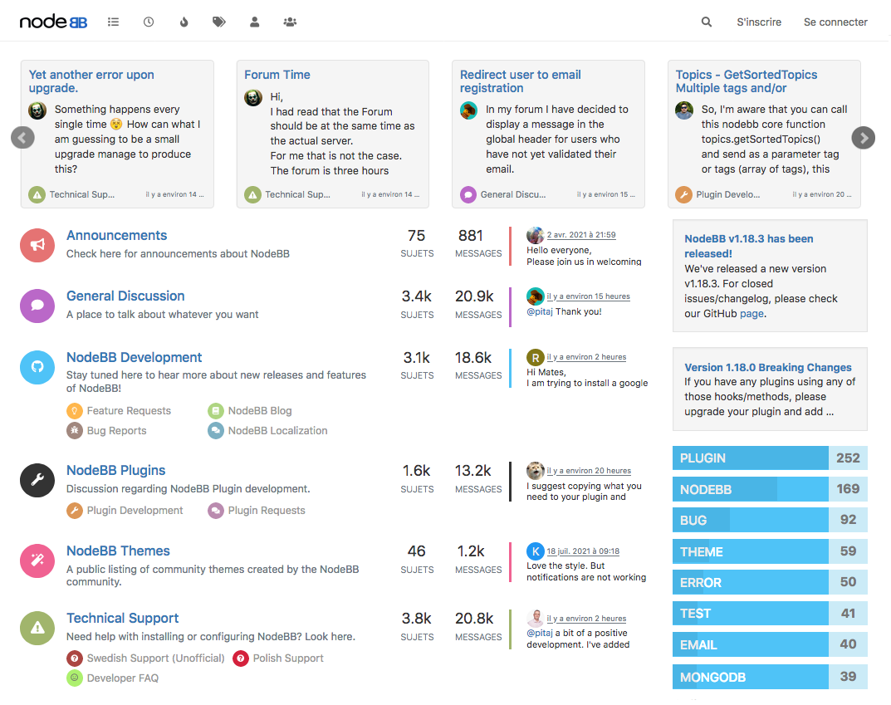

<!--
N.B.: This README was automatically generated by <https://github.com/YunoHost/apps/tree/master/tools/readme_generator>
It shall NOT be edited by hand.
-->

# NodeBB for YunoHost

[](https://ci-apps.yunohost.org/ci/apps/nodebb/)


[](https://install-app.yunohost.org/?app=nodebb)

*[Read this README in other languages.](./ALL_README.md)*

> *This package allows you to install NodeBB quickly and simply on a YunoHost server.*  
> *If you don't have YunoHost, please consult [the guide](https://yunohost.org/install) to learn how to install it.*

## Overview

NodeBB is built using the Node.js server-side Javascript platform, delivering unmatched performance.
Building on this high performance platform means fast and dependable performance that will support even the biggest and most active community.

**Shipped version:** 4.0.1~ynh1

**Demo:** <https://try.nodebb.org>

## Screenshots



## Documentation and resources

- Official app website: <https://nodebb.org>
- Official admin documentation: <https://docs.nodebb.org>
- Upstream app code repository: <https://github.com/NodeBB/NodeBB>
- YunoHost Store: <https://apps.yunohost.org/app/nodebb>
- Report a bug: <https://github.com/YunoHost-Apps/nodebb_ynh/issues>

## Developer info

Please send your pull request to the [`testing` branch](https://github.com/YunoHost-Apps/nodebb_ynh/tree/testing).

To try the `testing` branch, please proceed like that:

```bash
sudo yunohost app install https://github.com/YunoHost-Apps/nodebb_ynh/tree/testing --debug
or
sudo yunohost app upgrade nodebb -u https://github.com/YunoHost-Apps/nodebb_ynh/tree/testing --debug
```

**More info regarding app packaging:** <https://yunohost.org/packaging_apps>
